# Bruce's Treasure - Technical Documentation

## Table of Contents

1. [Game Overview](#game-overview)
2. [Architecture](#architecture)
3. [Configuration Constants](#configuration-constants)
4. [Core Systems](#core-systems)
5. [Game States](#game-states)
6. [Entity Relationships](#entity-relationships)
7. [Main Game Loop](#main-game-loop)

---

## Game Overview

Bruce's Treasure is a pygame-based dungeon crawler game where the player navigates procedurally generated dungeons, collects items, avoids hazards (spikes and traps), and progresses through levels to reach the Sun Treasure.

### Core Gameplay Loop

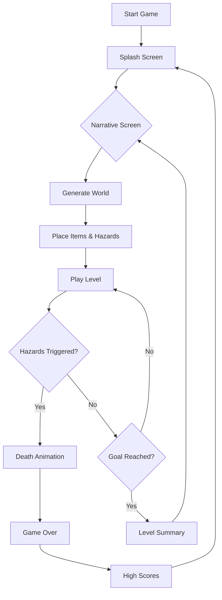

---

## Architecture

### System Overview

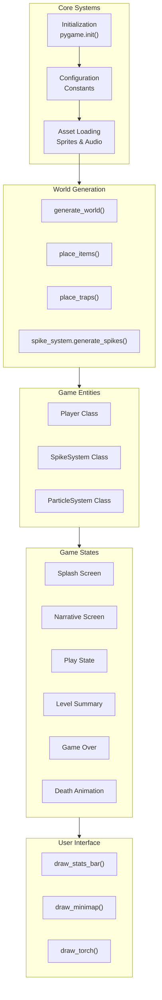

### File Structure

```
brucestreasure/
├── main.py              # Main game file (1074 lines)
├── narratives.json      # Level story text
├── highscores.txt       # Persistent high scores
├── assets/              # Game assets
│   ├── *.png           # Sprite images
│   ├── *.ogg           # Music tracks
│   ├── *.wav           # Sound effects
│   └── music.mp3       # Background music
└── README.md           # This documentation
```

---

## Configuration Constants

The game uses several configuration constants defined at the top of [`main.py`](main.py:1):

### World Configuration

| Constant | Value | Description |
|----------|-------|-------------|
| `TILE_SIZE` | 32 | Size of each tile in pixels |
| `WORLD_COLS` | 120 | Number of columns in the world grid |
| `WORLD_ROWS` | 120 | Number of rows in the world grid |
| `VISIBLE_COLS` | Dynamic | Columns visible on screen |
| `VISIBLE_ROWS` | Dynamic | Rows visible on screen |

### Tile Types

| Constant | Value | Description |
|----------|-------|-------------|
| `FLOOR` | 0 | Walkable floor tile |
| `WALL` | 1 | Solid wall - blocks movement |
| `SPIKE` | 2 | Hazard that extends/retracts |
| `TRAP` | 10 | Hole that kills player on step |
| `GOAL` | 9 | Sun treasure - level completion |

### Difficulty Parameters

| Constant | Value | Description |
|----------|-------|-------------|
| `SPIKE_PROFUSION` | 0.07 | Probability of spike generation (7%) |
| `TRAP_PROFUSION` | 0.08 | Probability of trap placement (8%) |
| `MIN_PATH_WIDTH` | 2 | Minimum corridor width |
| `FIREBALL_PROFUSION` | 0.03 | Probability of fireball generation (3%) |
| `SPIKE_DAMAGE` | 20 | Damage taken when hit by a spike |
| `FIREBALL_DAMAGE` | 25 | Damage taken when hit by a fireball |
| `EXTRA_LIFE_THRESHOLD` | 250000 | Points needed to earn an extra life |
| `HEALTH_CAP` | 100000 | Maximum health value (50% of score, capped) |

---

## Core Systems

### 1. Asset Loading System

The game loads sprites and audio files from the `assets/` directory.

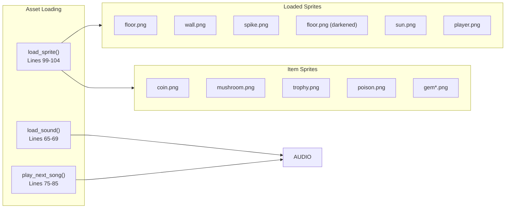

#### Sound Loading ([`main.py:65-94`](main.py:65))

```python
def load_sound(name):
    """Load a sound file from assets directory."""
    path = os.path.join(ASSET_PATH, name)
    if os.path.exists(path):
        return pygame.mixer.Sound(path)
    return None
```

The game loads the following sounds:
- `hit.wav` - Spike damage sound
- `coin.wav` - Item pickup sound
- `spike_extend.wav` - Spike activation sound
- `win.wav` - Level completion sound
- `trap_fall.wav` - Trap fall sound

#### Music Playlist ([`main.py:71`](main.py:71))

```python
MUSIC_PLAYLIST = ["music.mp3", "01.ogg", "02.ogg", "03.ogg", "04.ogg", 
                  "05.ogg", "06.ogg", "07.ogg", "08.ogg"]
```

Songs are randomly selected and played in a loop using pygame's `USEREVENT` system.

---

### 2. World Generation System

The dungeon is procedurally generated using a room-and-corridor algorithm.

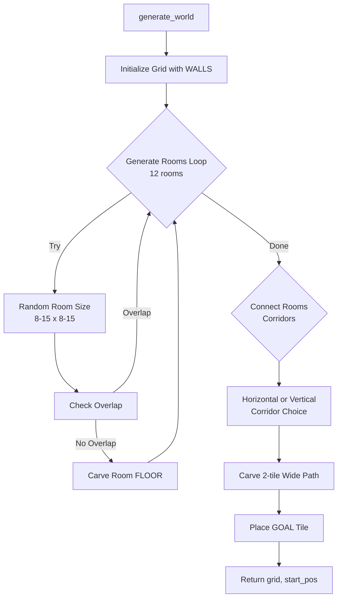

#### Room Generation ([`main.py:233-294`](main.py:233))

```python
def generate_world():
    """Generate a procedural dungeon with rooms and corridors."""
    grid = [[WALL for _ in range(WORLD_COLS)] for _ in range(WORLD_ROWS)]
    rooms = []

    # Generate 12 non-overlapping rooms
    for _ in range(12):
        w = random.randint(8, 15)
        h = random.randint(8, 15)
        x = random.randint(3, WORLD_COLS - w - 3)
        y = random.randint(3, WORLD_ROWS - h - 3)

        new_room = pygame.Rect(x, y, w, h)
        # Check collision with existing rooms (with padding)
        # ...
```

#### Corridor Generation ([`main.py:256-279`](main.py:256))

Rooms are connected using 2-tile wide corridors:
- If horizontal distance > vertical distance: horizontal corridor
- Otherwise: vertical corridor

```python
# Corridor carving logic
if abs(door1_x - door2_x) > abs(door1_y - door2_y):
    # Horizontal corridor with 2-tile width
    for x in range(min(door1_x, door2_x) - 1, max(door1_x, door2_x) + 2):
        for lane in [0, 1]:
            grid[int(door1_y + lane)][int(x)] = FLOOR
```

---

### 3. Item Placement System

Items are randomly placed on floor tiles based on spawn probabilities.

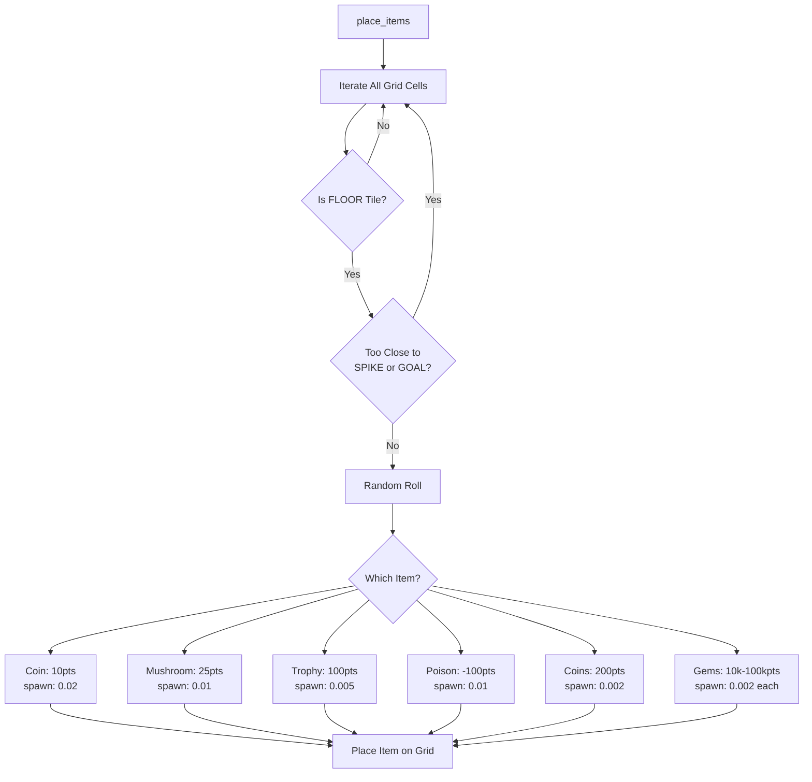

#### Item Types ([`main.py:160-171`](main.py:160))

```python
ITEM_TYPES = {
    3: {"name": "Coin", "points": 10, "spawn": 0.02, "sprite": "coin.png"},
    4: {"name": "Mushroom", "points": 25, "spawn": 0.01, "sprite": "mushroom.png"},
    6: {"name": "Trophy", "points": 100, "spawn": 0.005, "sprite": "trophy.png"},
    7: {"name": "Poison", "points": -100, "spawn": 0.01, "sprite": "poison.png"},
    8: {"name": "Coins", "points": 200, "spawn": 0.002, "sprite": "coins.png"},
    90: {"name": "Medium Yellow Gem", "points": 10000, "spawn": 0.002},
    100: {"name": "Big Yellow Gem", "points": 100000, "spawn": 0.002},
    110: {"name": "Purple Gem", "points": 80000, "spawn": 0.002},
    120: {"name": "Blue Gem", "points": 80000, "spawn": 0.002},
    130: {"name": "Green Gem", "points": 80000, "spawn": 0.002}
}
```

---

### 4. Hazard Systems

#### Spike System

Spikes are timed hazards that extend from walls into adjacent floor tiles.

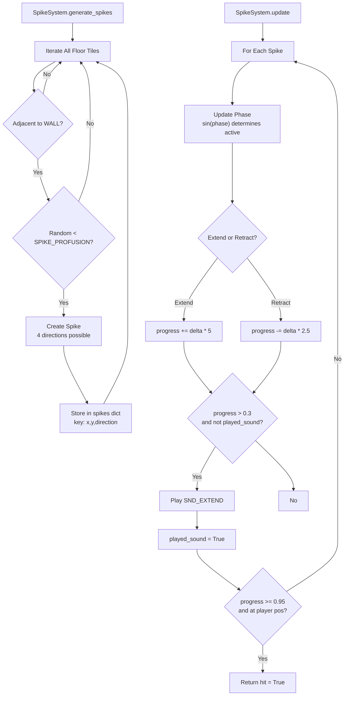

#### Spike Properties ([`main.py:374-450`](main.py:374))

```python
class SpikeSystem:
    def __init__(self):
        self.spikes = {}  # Dictionary of active spikes

    def generate_spikes(self, grid):
        # Spikes spawn on floor tiles next to walls
        # Direction: BOTTOM, TOP, RIGHT, LEFT
        # Each spike has: origin, target, direction, phase, extend_progress
```

Spike animation:
- Uses sine wave for extend/retract cycle
- Extends faster (speed 5) than retracts (speed 2.5)
- Becomes dangerous at 95% extension
- Sound plays at 30% extension

#### Trap System

Traps are holes that instantly kill the player when stepped on.

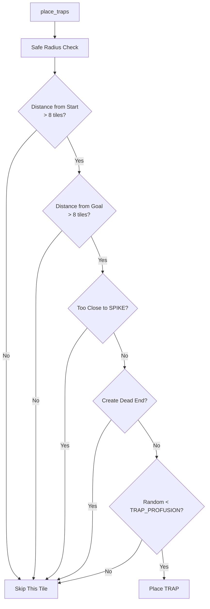

#### Trap Placement Rules ([`main.py:326-359`](main.py:326))

```python
def place_traps(grid, start_pos, goal_pos):
    safe_radius = 8  # Minimum distance from start/goal
    
    # Skip if:
    # 1. Not a floor tile
    # 2. Within safe radius of start
    # 3. Within safe radius of goal
    # 4. Too close to existing spikes
    # 5. Would create a dead end (only 1 floor neighbor)
```

---

### 5. Particle System

Visual effects for collecting items and taking damage.

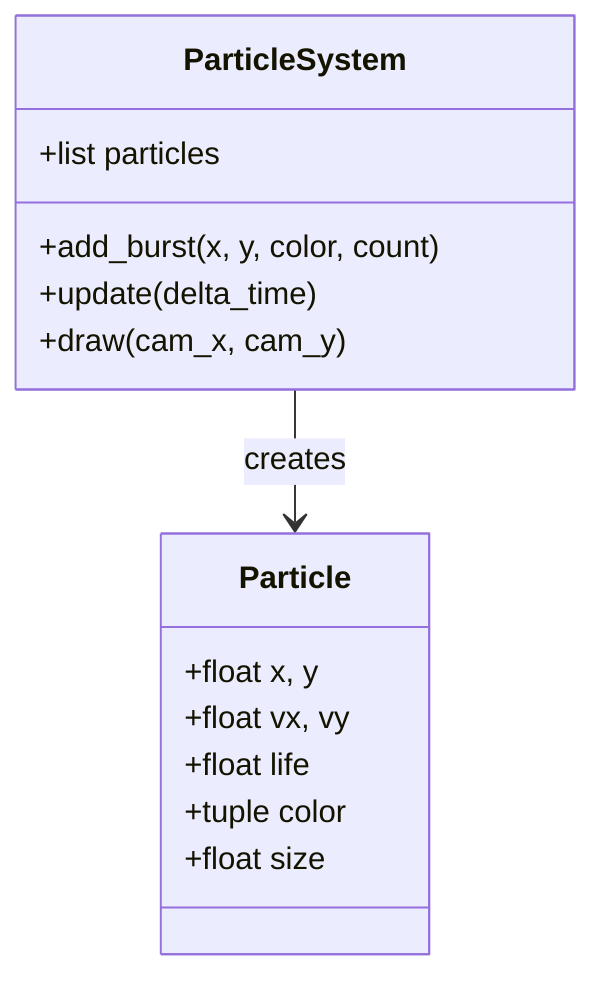

#### Particle Properties ([`main.py:120-154`](main.py:120))

```python
class ParticleSystem:
    def add_burst(self, x, y, color=(255, 255, 100), count=8):
        """Create explosion of particles at position."""
        for _ in range(count):
            self.particles.append({
                "x": x, "y": y,
                "vx": random.uniform(-80, 80),
                "vy": random.uniform(-80, 80),
                "life": 1.0,
                "color": color,
                "size": random.uniform(2, 6)
            })
```

Particle physics:
- Velocity: random direction, -80 to 80 pixels/sec
- Gravity: 300 pixels/sec²
- Life decay: 3 units per second
- Fades out as life decreases

---

### 6. Player System

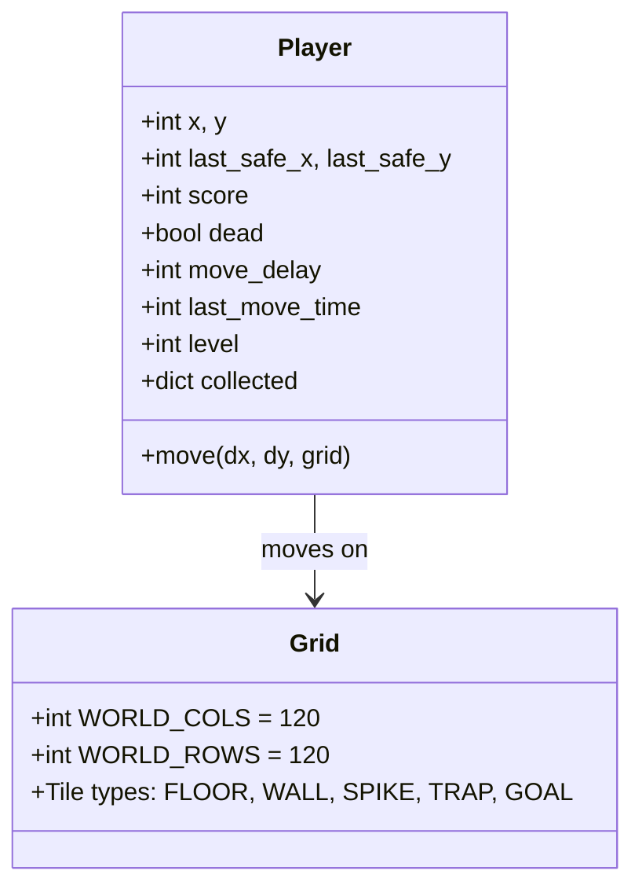

#### Player Movement ([`main.py:477-515`](main.py:477))

```python
def move(self, dx, dy, grid):
    # Movement cooldown check (140ms)
    # Boundary checks (0 to WORLD_COLS-1)
    # Wall collision check
    # Handle tile interactions:
    #   - TRAP: Kill player, return "TRAP_DEATH"
    #   - ITEM_TYPES: Add points, play sound, collect
    #   - GOAL: Return "NEXT" to advance level
```

---

### 7. Camera System

Smooth scrolling camera that follows the player.

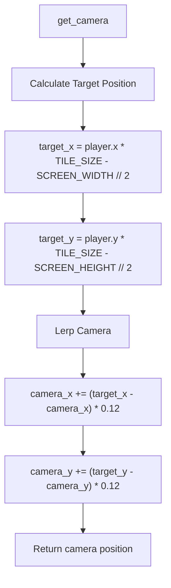

#### Camera Implementation ([`main.py:524-530`](main.py:524))

```python
def get_camera(player):
    global camera_x, camera_y
    target_x = player.x * TILE_SIZE - SCREEN_WIDTH // 2
    target_y = player.y * TILE_SIZE - SCREEN_HEIGHT // 2
    camera_x += (target_x - camera_x) * 0.12  # Smooth interpolation
    camera_y += (target_y - camera_y) * 0.12
    return int(camera_x), int(camera_y)
```

---

## Game States

The game uses 7 distinct states managed by the main loop.

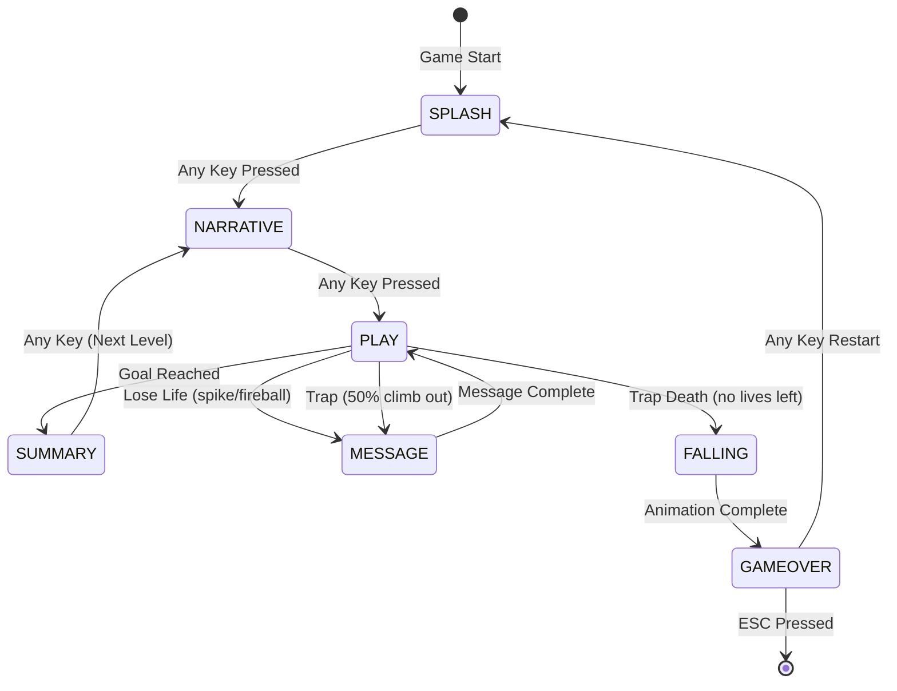

### State Definitions

| State | Constant | Description |
|-------|----------|-------------|
| SPLASH | `STATE_SPLASH` | Title screen with ASCII art and player character |
| NARRATIVE | `STATE_NARRATIVE` | Story text between levels |
| PLAY | `STATE_PLAY` | Main gameplay |
| SUMMARY | `STATE_SUMMARY` | Level completion celebration |
| MESSAGE | `STATE_MESSAGE` | Life loss messages with backgrounds |
| FALLING | `STATE_FALLING` | Trap death animation with pit background |
| GAMEOVER | `STATE_GAMEOVER` | Death screen with high scores |

### State Handlers

#### Splash Screen ([`main.py:1146-1195`](main.py:1146))

Displays the player character image alongside ASCII art title:
- **Player Character**: Large playerBig.png displayed on the left side
- **ASCII Title**: Green ASCII art on the right side
- **Version**: Displayed below the title
- **Prompt**: "PRESS ANY KEY TO BEGIN" 

The splash screen now features the full-resolution player character image (800x1280) scaled to fit, creating a more engaging title screen.

#### Narrative Screen ([`main.py:750-817`](main.py:750))

Shows level-specific story text loaded from [`narratives.json`](narratives.json):
- Level title in gold
- Story text in white
- Level number in purple
- Optional background image from assets

#### Level Summary ([`main.py:652-690`](main.py:652))

Celebration screen shown after completing a level:
- "LEVEL COMPLETE!" title with glow effect
- Level number, score gained, total score
- Animated sun graphic with glow rings
- "Press ANY KEY" prompt

#### Death Animation ([`main.py:609-646`](main.py:609))

Spinning spiral animation that creates a "falling into hole" effect:
- Black spiral arcs expanding inward
- Growing black circle in center
- "YOU FELL!" text fading out

---

## Entity Relationships

### Grid Coordinate System

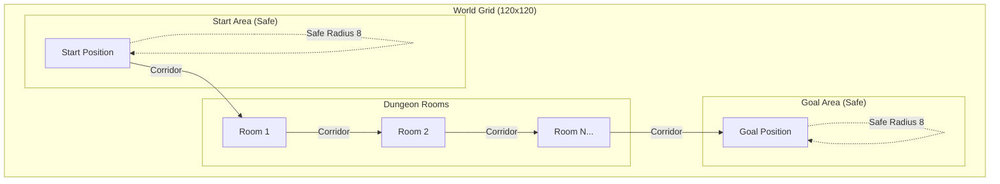

### Level Progression

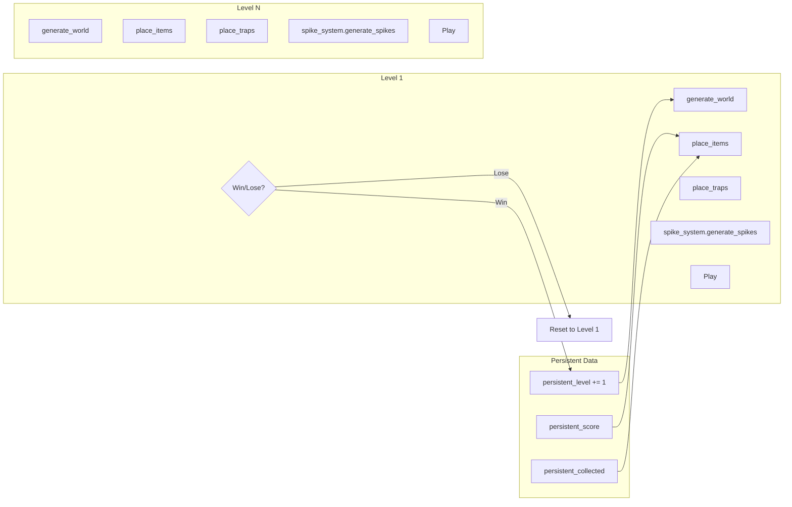

---

## Main Game Loop

The main loop runs at 60 FPS and handles all game logic.

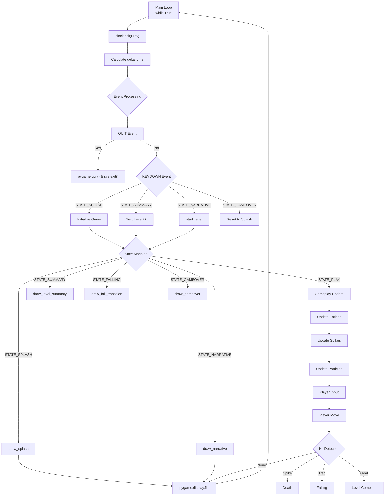

### Main Loop Implementation ([`main.py:938-1074`](main.py:938))

```python
while True:
    clock.tick(FPS)
    current_time = pygame.time.get_ticks()
    delta_time = (current_time - last_time) / 1000.0
    last_time = current_time

    for event in pygame.event.get():
        # Handle all game events
        if event.type == SONG_FINISHED:
            play_next_song()
        # ... state-specific key handling

    # State-based rendering and logic
    if state == STATE_PLAY:
        # Update systems
        particles.update(delta_time)
        player.dead = spike_system.update(delta_time, player.x, player.y, particles)
        # Handle input
        # Check collisions
        # Render
    
    pygame.display.flip()
```

---

### 8. Health and Lives System

Players now have a health and lives system that adds strategy to hazard encounters.

#### Health System

- **Health Calculation**: Health = 50% of current score (dynamically calculated)
- **Health Cap**: Maximum health is 100,000
- **Spike Damage**: 20 health points per spike hit
- **Fireball Damage**: 25 health points per fireball hit
- **Death Condition**: When health drops to 0 or below, player loses a life

#### Lives System

- **Starting Lives**: 5 lives at game start
- **Extra Lives**: Earn +1 life for every 250,000 points
- **On Life Loss**:
  - Score resets to 0
  - All collected items are lost
  - Level progression is maintained
  - "You lost a life!" message displayed
- **Game Over**: Only triggers when lives reach 0

#### Trap/Hole Mechanics

When falling into a trap (hole):
- 50% chance to climb out and survive
- 50% chance to lose a life
- Messages displayed: "You climbed out!" or "You lost a life!"

#### Message Screens

Life loss events show themed backgrounds:
- `LIFE_LOSS_BG_FILES` - Backgrounds for life loss messages
- `FALL_BG_FILES` - Backgrounds for falling animation (e.g., pit.jpg)

---

### 9. Fireball System

Fireballs are projectile hazards that travel across corridors.

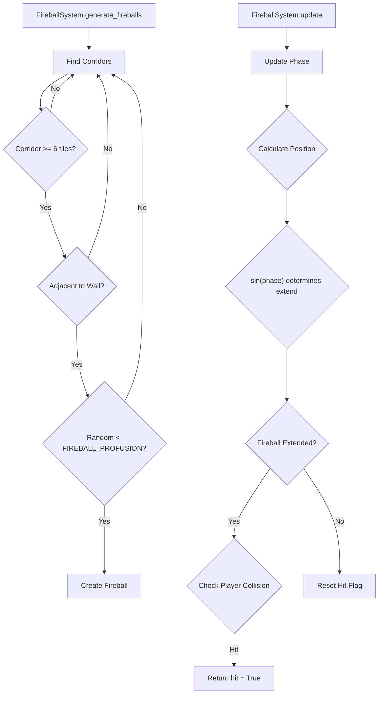

#### Fireball Properties

- **Spawn**: Corridors of 6+ tiles adjacent to walls
- **Movement**: Emerge from wall, travel across, disappear into opposite wall
- **Cycle**: Uses sine wave for extend/retract (like spikes)
- **Collision**: Only damages player when extended (50%+ progress)
- **Configurable**: `FIREBALL_PROFUSION`, `FIREBALL_DAMAGE`, `FIREBALL_SPEED`

---

## UI Components

### Stats Bar ([`main.py:173-211`](main.py:173))

Displays at the top of the screen during gameplay:
- Current level number
- Total score
- Collected item counts with icons

### Minimap ([`main.py:553-562`](main.py:553))

200x200 pixel map in the top-right corner:
- Gray dots for floor tiles
- Red dot for player position

### Torch Effect ([`main.py:546-551`](main.py:546))

Darkness overlay creating a "torch lit" atmosphere:
- Semi-transparent black overlay (alpha 220)
- Clear circle around player (200px radius)

---

## Audio System

### Sound Effects

| Sound | Trigger | File |
|-------|---------|------|
| Spike hit | Player touched by spike | spikehit.mp3 |
| Item pickup | Collect any item | coin.wav |
| Spike extend | Spike starts extending | spike_extend.wav |
| Level win | Reach goal tile | win.wav |
| Trap fall | Step on trap | fall.mp3 |
| Extra life | Earn bonus life | extra_life.mp3 |

### Music System

- Playlist of 9 audio files
- Random selection on each song end
- Volume: 50%

---

## File Dependencies

```mermaid
flowchart TD
    main.py --> narratives.json
    main.py --> highscores.txt
    main.py --> assets/
    
    assets --> floor.png
    assets --> wall.png
    assets --> spike.png
    assets --> sun.png
    assets --> player.png
    assets --> coin.png
    assets --> mushroom.png
    assets --> trophy.png
    assets --> poison.png
    assets --> coins.png
    assets --> gem10k.png
    assets --> gem80ka.png
    assets --> gem80kb.png
    assets --> gem80kc.png
    assets --> gem100k.png
    
    assets --> music.mp3
    assets --> 01.ogg
    assets --> 02.ogg
    assets --> 03.ogg
    assets --> 04.ogg
    assets --> 05.ogg
    assets --> 06.ogg
    assets --> 07.ogg
    assets --> 08.ogg
    
    assets --> coin.wav
    assets --> hit.wav
    assets --> spike_extend.wav
    assets --> win.wav
    assets --> trap_fall.wav
    
    assets --> narrative_01.jpg
    assets --> narrative_02.png
    assets --> narrative_03.png
    
    assets --> fireball.png
    assets --> playerBig.png
    assets --> pit.jpg
    assets --> lostlife.png
    
    assets --> spikehit.mp3
    assets --> fall.mp3
    assets --> extra_life.mp3
```

---

## Controls

| Key | Action |
|-----|--------|
| Arrow Keys / WASD | Move player |
| Any Key | Advance screens |
| ESC | Quit game |

---

## Technical Notes

### Performance Considerations

1. **Viewport Culling**: Only tiles visible on screen are rendered ([`main.py:571`](main.py:571))
2. **Delta Time**: All physics use delta_time for frame-rate independence
3. **Object Pooling**: Particles are reused rather than recreated

### Color Palette

| Color | RGB | Usage |
|-------|-----|-------|
| GOLD | (255, 215, 0) | Score, titles |
| SUN | (255, 223, 0) | Sun graphics |
| GREEN | (0, 255, 100) | Success messages |
| BLUE | (100, 200, 255) | UI elements |
| PURPLE | (200, 100, 255) | Level numbers |
| RED | (255, 100, 100) | Warnings, poison |

---

*Documentation generated for Bruce's Treasure v1.1*

## Changelog v1.1

### New Features
- Health and Lives system
- Fireball hazards
- Enhanced splash screen with player character
- Message screens with themed backgrounds
- Extra life bonus every 250k points

### Changes
- Spikes now deal damage instead of instant death
- Traps have 50% chance to climb out
- Game over only when lives reach 0
- Health capped at 100,000
